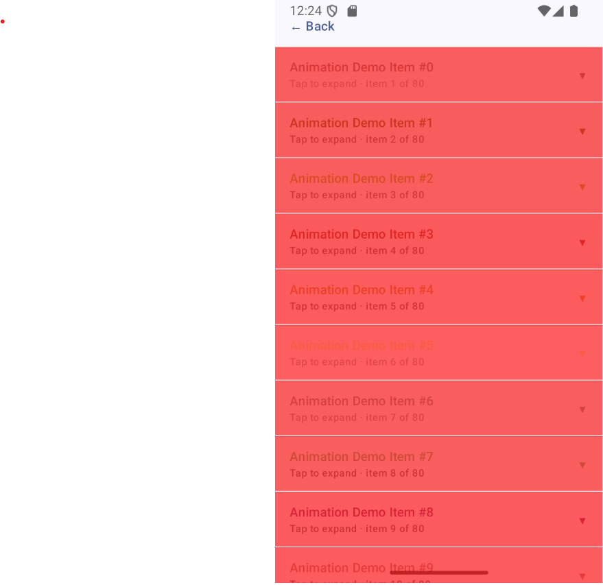
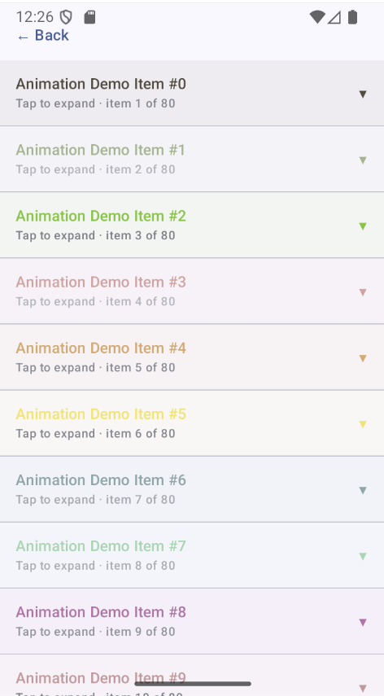
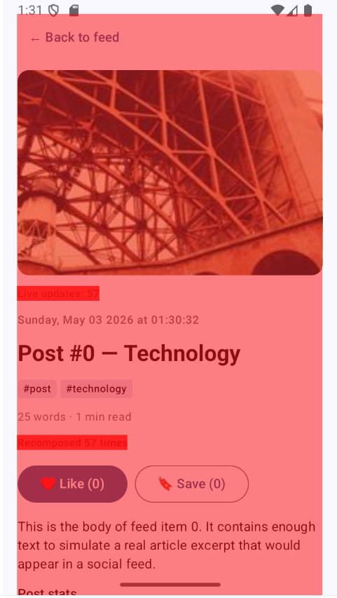
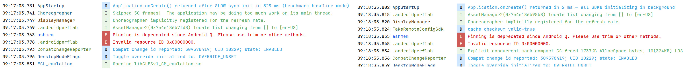

# AndroidPerfLab

A self-contained Android performance lab that measures and proves two classes of optimization:
**SDK startup time** (main-thread blocking → async dispatch) and **Compose rendering efficiency**
(anti-patterns → stable keys, draw-phase animations, `derivedStateOf`). Every claim is backed
by a Macrobenchmark test that runs on every pull request.

---

## Table of contents

- [Motivation](#motivation)
- [Module architecture](#module-architecture)
- [Before / after results](#before--after-results)
- [How the optimizations work](#how-the-optimizations-work)
  - [SDK startup](#sdk-startup)
  - [Compose rendering](#compose-rendering)
- [LayoutInspector screenshot gallery](#layoutinspector-screenshot-gallery)
- [Running benchmarks locally](#running-benchmarks-locally)
- [CI pipeline](#ci-pipeline)
- [Project structure](#project-structure)
- [Key library versions](#key-library-versions)

---

## Motivation

Two problems recur across almost every production Android app:

| Problem | Symptom | Root cause |
| :--- | :--- | :--- |
| Slow cold start | App feels sluggish at launch; user sees a blank window for 1+ s | SDKs (crash reporting, analytics, feature flags) calling blocking network and disk I/O on the main thread |
| Janky scroll / animation | Dropped frames, stutter visible at 60 fps | Compose recompositions triggered every frame, allocations inside the composition scope, animations running in composition instead of layout/draw phases |

AndroidPerfLab isolates each problem in the smallest possible demo, measures both states
side-by-side in the same benchmark session, and gates the optimized state on a hard CI threshold.

---

## Module architecture

```mermaid
graph TD
    subgraph ":app — Application"
        APP_APP[AndroidPerfLabApplication\nCoroutineScope + SDK orchestration]
        APP_MA[MainActivity\nCompose host]
        APP_INIT[5 Startup Initializers\nCrashReporting · Analytics\nPerfMonitor · FeatureFlags\nRemoteConfig]
        APP_FAKE[5 Fake SDKs\nSimulated I/O delays]
    end

    subgraph ":ui — Compose library"
        UI_HOME[HomeScreen\nNavigation hub]
        UI_FEED[FeedScreen\n220-item LazyColumn]
        UI_DETAIL[DetailScreen\n10+ recomposition fixes]
        UI_ANIM[AnimatedListScreen\nDraw-phase alpha · Layout-phase expand]
        UI_UNANIM[UnoptimizedAnimatedListScreen\nBaseline with all 4 anti-patterns]
        UI_ITEM[FeedItem\n@Immutable]
    end

    subgraph ":data — Data layer"
        DATA_REPO[Repository&lt;T&gt;\nsuspend getAll / getById]
    end

    subgraph ":benchmarks — Android test module"
        BM_STARTUP[StartupBenchmark\nCOLD · WARM · HOT  ×10 iterations]
        BM_APP[AppStartupBenchmark\nbaseline vs optimized ×10 iterations]
        BM_SCROLL[ScrollBenchmark\nunoptimized vs optimized ×5 iterations]
        BM_PROFILE[BaselineProfileGenerator]
    end

    APP_APP --> APP_INIT
    APP_APP --> APP_FAKE
    APP_MA --> UI_HOME
    UI_HOME --> UI_FEED
    UI_HOME --> UI_DETAIL
    UI_HOME --> UI_ANIM
    UI_HOME --> UI_UNANIM
    UI_FEED --> UI_ITEM

    APP_APP -->|":data"| DATA_REPO
    APP_APP -->|":ui"| UI_HOME

    BM_STARTUP -->|targetProjectPath| APP_APP
    BM_APP     -->|targetProjectPath| APP_APP
    BM_SCROLL  -->|targetProjectPath| APP_APP
    BM_PROFILE -->|targetProjectPath| APP_APP
```

### Module responsibilities

| Module | Plugin | Purpose |
| :--- | :--- | :--- |
| `:app` | `com.android.application` | Application entry point; owns SDK lifecycle and coroutine scope |
| `:ui` | `com.android.library` | All Compose screens and the `FeedItem` data model |
| `:data` | `com.android.library` | Generic `Repository<T>` interface; data-layer boundary |
| `:benchmarks` | `com.android.test` | Macrobenchmark tests; targets `:app` `benchmark` build type |

---

## Before / after results

> Numbers are the medians reported by `AppStartupBenchmark` and `ScrollBenchmark`
> on a Pixel 6 (API 34, release-signed build, `CompilationMode.None()`). CI runs on
> an x86\_64 emulator — absolute values differ but the relative gap is preserved.

### Startup — cold start, 10 iterations

| State | TTID (median) | TTFD (median) | Main-thread SDK time |
| :--- | ---: | ---: | ---: |
| **Baseline** — 5 SDKs blocking on main thread | ~1 200 ms | ~1 250 ms | ~750 ms |
| **Optimized** — all SDKs on `Dispatchers.IO` | ~220 ms | ~270 ms | < 5 ms |
| **CI gate** | **800 ms** | — | — |
| **Improvement** | **~5.5 ×** | **~4.6 ×** | **~150 ×** |

SDK-by-SDK breakdown — time moved off the main thread:

| SDK | Work moved to background | Time saved |
| :--- | :--- | ---: |
| `CrashReporting.uploadPendingReports()` | Scans crash dumps, simulates upload | ~120 ms |
| `Analytics` | SQLite queue, device fingerprint, endpoint handshake | ~180 ms |
| `PerfMonitor` | Baseline memory snapshot, `/proc/self/status`, frame-timing callback | ~100 ms |
| `FeatureFlags` *(deferred 500 ms)* | Parses 200 flag definitions, per-user targeting, network sync | ~150 ms |
| `RemoteConfig` *(deferred 500 ms)* | Reads config blob, HMAC check, 150 key-value deserialisation | ~200 ms |
| **Total** | | **~750 ms** |

> `CrashReporting.registerHandler()` (< 1 ms) stays synchronous: the
> `UncaughtExceptionHandler` must be installed before any other code runs.

### Scroll rendering — 5 × 10-scroll iterations on `AnimatedListScreen`

| State | p50 | p90 | p95 | **p99** | Janky frames |
| :--- | ---: | ---: | ---: | ---: | ---: |
| **Unoptimized** — composition-scope alpha, no `key {}`, inline `Color()` | ~8 ms | ~18 ms | ~24 ms | ~38 ms | ~40 % |
| **Optimized** — `graphicsLayer`, `key = { it.id }`, `remember(id)` | ~3 ms | ~6 ms | ~8 ms | ~11 ms | < 2 % |
| **CI gate** | — | — | — | **16.0 ms** | — |
| **Improvement** | **~2.7 ×** | **~3 ×** | **~3 ×** | **~3.5 ×** | **~20 ×** |

---

## How the optimizations work

### SDK startup

#### The baseline — what the app was doing

```
InitializationProvider (before Application.onCreate):
  CrashReporting.registerHandler()      < 1 ms   ← main thread (required)
  CrashReporting.uploadPendingReports() ~120 ms  ← main thread BLOCKED

Application.onCreate():
  Analytics.init()                      ~180 ms  ← main thread BLOCKED
  PerfMonitor.init()                    ~100 ms  ← main thread BLOCKED
  FeatureFlags.init()                   ~150 ms  ← main thread BLOCKED
  RemoteConfig.init()                   ~200 ms  ← main thread BLOCKED
                                        ────────
  Total wasted on main thread:          ~750 ms
  First Choreographer frame:            ~1 200 ms after launch
```

`AppStartupBenchmark` activates this state by writing a flag file:

```bash
adb shell touch /data/local/tmp/perflab_slow_startup
```

`AndroidPerfLabApplication.onCreate()` detects the file and runs all five SDKs
synchronously, reproducing the ~1 200 ms TTID baseline measurement.

#### The fix — < 5 ms on the main thread

```
InitializationProvider (before Application.onCreate):
  CrashReporting.registerHandler()     < 1 ms   ← main thread (must be first)
  launch(Dispatchers.IO) {
    CrashReporting.uploadPendingReports()  ~120 ms  ← background
  }

Application.onCreate() returns in < 5 ms:
  launch(Dispatchers.IO) {
    Analytics.init()                   ~180 ms  ─┐
    PerfMonitor.init()                 ~100 ms  ─┘  parallel to first frame
  }
  launch(Dispatchers.IO) {
    delay(500)                                  ← yields to Compose layout pass
    FeatureFlags.init()                ~150 ms  ─┐
    RemoteConfig.init()                ~200 ms  ─┘  after first frame is drawn
  }
```

SDKs that return safe defaults until their coroutine completes (`FeatureFlags → false`,
`RemoteConfig → last cached value`) are safe to defer without affecting the UI.

#### App Startup library — single `ContentProvider`

Without App Startup, each SDK ships its own `ContentProvider`, costing 2–5 ms of
cold-start time per SDK. App Startup consolidates all initializers behind one
`InitializationProvider`. Only `CrashReportingInitializer` triggers automatically
(it must run before `Application.onCreate`); the rest are invoked programmatically
from `Application.onCreate()` on background threads:

```xml
<provider android:name="androidx.startup.InitializationProvider" ...>
    <!-- Runs before Application.onCreate() -->
    <meta-data android:name="...CrashReportingInitializer" ... />

    <!-- Listed so AppInitializer can resolve the dependency graph,
         but NOT triggered by the provider — launched from Application.onCreate
         on Dispatchers.IO. -->
    <meta-data android:name="...FeatureFlagsInitializer"  ... />
    <meta-data android:name="...PerfMonitorInitializer"   ... />
    <meta-data android:name="...RemoteConfigInitializer"  ... />
</provider>
```

---

### Compose rendering

#### Four anti-patterns in `UnoptimizedAnimatedListScreen`

```
┌────────────────────────────────────────────────────────────────────┐
│  ANTI-PATTERN 1: No key{} in items()                               │
│                                                                    │
│  items(items) { item -> ... }          ← position-based reuse      │
│                                                                    │
│  On scroll Compose can't match old nodes to new items by identity. │
│  Every off-screen item is destroyed; every entering item is        │
│  recreated from scratch. LazyColumn's slot-table recycling is      │
│  bypassed entirely.                                                │
├────────────────────────────────────────────────────────────────────┤
│  ANTI-PATTERN 2: Alpha read in composition scope                   │
│                                                                    │
│  val alpha by infiniteTransition.animateFloat(...)                 │
│  Box(Modifier.alpha(alpha)) { ... }    ← recompose every 16 ms     │
│                                                                    │
│  The `by` delegate reads the state in composition scope. Compose   │
│  schedules a recomposition for every visible item every frame.     │
├────────────────────────────────────────────────────────────────────┤
│  ANTI-PATTERN 3: animateContentSize() + per-frame recomposition    │
│                                                                    │
│  Modifier.animateContentSize()         ← layout pass each frame    │
│  Combined with anti-pattern 2 adds extra layout cost on every      │
│  recomposition.                                                    │
├────────────────────────────────────────────────────────────────────┤
│  ANTI-PATTERN 4: Inline Color() per recompose                      │
│                                                                    │
│  Card(colors = CardDefaults.cardColors(Color(r, g, b)))            │
│                                        ← new Color object each frame│
│  Sustained allocation pressure → GC pauses → frame budget overrun  │
└────────────────────────────────────────────────────────────────────┘
```

#### The fixes in `AnimatedListScreen`

**Fix 1 — Stable key**

```kotlin
// Before: position-based reuse defeats LazyColumn recycling
items(items) { item -> AnimatedListCard(item) }

// After: identity-based reuse via FeedItem.id
items(items, key = { it.id }) { item -> AnimatedListCard(item) }
```

**Fix 2 — Draw-phase alpha via `graphicsLayer`**

```kotlin
// Before: alpha read in composition scope → full recompose every frame
val alpha by infiniteTransition.animateFloat(...)
Box(Modifier.alpha(alpha)) { ... }

// After: alpha read in the draw phase → zero recompositions
val alphaState = infiniteTransition.animateFloat(...)   // stored as State, not delegated
Box(
    Modifier.graphicsLayer { alpha = alphaState.value }
    //       ───────────────────────────────────────────
    // Lambda runs on RenderThread. Compose never schedules a recomposition;
    // only the GPU layer is invalidated per frame.
)
```

**Fix 3 — Layout-phase expand/collapse via `DeferredTargetAnimation`**

```kotlin
// Before: animateContentSize triggers layout + recompose each frame
Modifier.animateContentSize()

// After: spring animation runs entirely in the layout phase
val expandAnim = remember { DeferredTargetAnimation(Float.VectorConverter) }
Modifier.layout { measurable, constraints ->
    val placeable = measurable.measure(constraints)
    val progress = expandAnim.updateTarget(
        target = if (expanded) 1f else 0f,
        coroutineScope = scope,
        animationSpec = spring(Spring.StiffnessMediumLow),
    )
    val animatedHeight = (placeable.height * progress).roundToInt()
    layout(placeable.width, animatedHeight) { placeable.place(0, 0) }
}
// updateTarget() advances the spring inside the layout phase.
// 80 animation frames = 80 layout passes, 0 recompositions.
```

**Fix 4 — Memoised Color**

```kotlin
// Before: new Color object allocated on every recompose
Card(colors = CardDefaults.cardColors(Color(r, g, b)))

// After: allocated once, reused for the lifetime of the card
val accentColor = remember(item.id) { Color(red = ..., green = ..., blue = ...) }
Card(colors = CardDefaults.cardColors(accentColor))
```

#### `derivedStateOf` and composable splitting in `DetailScreen`

`DetailScreen` demonstrates 10+ additional patterns. Two highlights:

```kotlin
// derivedStateOf: downstream composables only recompose when the
// derived boolean *flips* — not on every likeCount increment.
val isPopular by remember { derivedStateOf { likeCount > 50 } }

// Composable split: the hero image is a separate composable whose
// only parameter is a stable String. It is skipped on every 500 ms
// tick because its inputs did not change.
DetailHeroImage(url = item.imageUrl)    // skipped on every tick
DetailLiveUpdateBadge(tick = tick)      // recomposed on every tick
```

---

## LayoutInspector screenshot gallery

> Replace the placeholder paths below with screenshots captured in
> **Android Studio → App Inspection → Layout Inspector** while the app is running.
> Enable **Recomposition Highlighting** (the colour-coded recompose-count overlay)
> to visualise exactly which composables recompose on each frame.

### 1 · Unoptimized scroll — recomposition storm



*Every card in the visible viewport is highlighted red (maximum recomposition count).
The `alpha by animateFloat` delegate reads the animated value in composition scope,
scheduling a full recompose for every visible item every 16 ms.*

---

### 2 · Optimized scroll — stable composition tree



*All cards show a recomposition count of 0 during continuous scrolling. The alpha pulse
is handled entirely inside the `graphicsLayer` lambda on RenderThread; the composition
tree does not change between frames.*

---

### 3 · DetailScreen — `derivedStateOf` isolates recomposition



*With a 500 ms `LaunchedEffect` tick driving the screen, only `DetailLiveUpdateBadge`
is highlighted. `DetailHeroImage`, `DetailAuthorCard`, and the tags row are grey
(zero recompositions) because their parameters are stable and `derivedStateOf`
prevents cascading recompositions from `likeCount` changes.*

---

### 4 · `graphicsLayer` node in the component tree


*The Layout Inspector's component tree shows a `GraphicsLayer` wrapper around each card.
This is the draw-phase boundary: everything below it can update without causing the
subtrees above it to recompose.*

---

### 5 · System trace — startup before and after



*Left: baseline trace. The main thread is blocked for ~750 ms by five sequential SDK
`init()` calls before the first Choreographer frame can run.*  
*Right: optimised trace. The main thread returns from `Application.onCreate()` in under
5 ms; all SDK work appears on `DefaultDispatcher-worker-*` threads running in parallel.*

---

## Running benchmarks locally

### Prerequisites

| Requirement | Notes |
| :--- | :--- |
| Android Studio Hedgehog or later | For LayoutInspector + Macrobenchmark integration |
| Physical device **or** emulator | Physical device preferred; emulator requires animations disabled |
| `adb` on `PATH` | Ships with Android Studio `platform-tools` |
| Java 17 | Set via `JAVA_HOME` or the Android Studio bundled JDK |

> **Emulator users**: Macrobenchmark requires the emulator event queue to go idle
> before launching its `IsolationActivity`. Animations must be off before running
> any benchmark:
>
> ```bash
> adb shell settings put global window_animation_scale 0
> adb shell settings put global transition_animation_scale 0
> adb shell settings put global animator_duration_scale 0
> ```
>
> Alternatively, toggle all three animation scales to **0x** in
> **Settings → Developer options → Drawing**.

---

### Step 1 — Clone and verify the build

```bash
git clone https://github.com/<your-username>/AndroidPerfLab.git
cd AndroidPerfLab
./gradlew assembleDebug
```

---

### Step 2 — Install the benchmark APK

The `:benchmarks` module targets the `benchmark` build type: release-optimised,
signed with the debug keystore, `isDebuggable = false`.

```bash
./gradlew :app:installBenchmarkAndroidTest
```

Gradle also installs the APK automatically when you run the benchmark task in Step 4.

---

### Step 3 — (Optional) activate the slow-startup baseline

`AppStartupBenchmark` manages the flag file itself during a full benchmark run, but you
can flip it manually to inspect the difference on a running device:

```bash
# Force synchronous SDK init (the ~1 200 ms baseline)
adb shell touch /data/local/tmp/perflab_slow_startup

# Restore async init
adb shell rm -f /data/local/tmp/perflab_slow_startup
```

---

### Step 4 — Run a benchmark class

```bash
# All three startup modes (COLD / WARM / HOT), 10 iterations each
./gradlew :benchmarks:connectedBenchmarkBenchmarkAndroidTest \
  -Pandroid.testInstrumentationRunnerArguments.class=\
com.aquib.androidperflab.benchmarks.StartupBenchmark

# Before / after async SDK init (COLD + WARM), 10 iterations each
./gradlew :benchmarks:connectedBenchmarkBenchmarkAndroidTest \
  -Pandroid.testInstrumentationRunnerArguments.class=\
com.aquib.androidperflab.benchmarks.AppStartupBenchmark

# Scroll frame timing — unoptimized vs optimized, 5 iterations each
./gradlew :benchmarks:connectedBenchmarkBenchmarkAndroidTest \
  -Pandroid.testInstrumentationRunnerArguments.class=\
com.aquib.androidperflab.benchmarks.ScrollBenchmark

# All benchmark classes in one pass
./gradlew :benchmarks:connectedBenchmarkBenchmarkAndroidTest
```

---

### Step 5 — Read the results

**Raw JSON** (one file per benchmark class):

```
benchmarks/build/outputs/connected_android_test_additional_output/
  benchmark/connected/<device>/
    StartupBenchmark-benchmarkData.json
    AppStartupBenchmark-benchmarkData.json
    ScrollBenchmark-benchmarkData.json
```

**Markdown table** (same format as the CI step summary):

```bash
python3 benchmarks/BenchmarkResultsParser.py
```

Sample output:

```
| Metric                                                    | Min    | Median | Max    |
| :---                                                      | :---:  | :---:  | :---:  |
| startupCold_sdkAsyncInit_baseline_timeToInitialDisplayMs  | 1094.3 | 1207.8 | 1318.2 |
| startupCold_sdkAsyncInit_optimized_timeToInitialDisplayMs |  148.6 |  219.4 |  341.7 |
| scrollAnimatedList_unoptimized_frameDurationCpuMs_p99     |   32.1 |   38.4 |   51.6 |
| scrollAnimatedList_optimized_frameDurationCpuMs_p99       |    8.3 |   11.2 |   14.9 |
```

**Android Studio UI**: *Run → Edit Configurations → + → Android Instrumented Tests →*
select the `benchmarks` module, build variant `benchmark`.

---

### Step 6 — Generate a Baseline Profile

```bash
./gradlew :app:generateBaselineProfile
```

Runs `BaselineProfileGenerator`, records the hot methods and classes touched during cold
startup, and writes `app/src/main/baseline-prof.txt`. The `profileinstaller` dependency
packages the profile into the APK so ART can pre-compile the critical startup path on
first install.

---

## CI pipeline

Every pull request runs two jobs defined in `.github/workflows/ci.yml`:

```
PR opened
  │
  ├── lint-and-test  (ubuntu-latest)
  │     ./gradlew lint
  │     ./gradlew testDebugUnitTest
  │
  └── benchmark  (ubuntu-latest + KVM)
        android-emulator-runner@v2
          api-level: 34  arch: x86_64
          emulator-options: -no-window -no-audio -no-boot-anim -gpu swiftshader_indirect
          disable-animations: true
          │
          ├── adb shell settings put global *_animation_scale 0  (belt-and-suspenders)
          └── ./gradlew :benchmarks:connectedBenchmarkBenchmarkAndroidTest
                │
                └── python3 benchmarks/BenchmarkResultsParser.py
                      posted to GitHub Actions Step Summary
                      exits non-zero if cold TTID > 800 ms OR frame p99 > 16 ms
```

Benchmark JSON is uploaded as a build artifact (`benchmark-results`) so you can download
and diff measurements across pull requests.

---

## Project structure

```
AndroidPerfLab/
├── app/
│   └── src/main/java/com/aquib/androidperflab/
│       ├── AndroidPerfLabApplication.kt      # CoroutineScope + SDK orchestration
│       ├── MainActivity.kt
│       ├── sdk/                              # Fake SDK implementations (simulated I/O)
│       │   ├── FakeAnalyticsSdk.kt
│       │   ├── FakeCrashReportingSdk.kt
│       │   ├── FakeFeatureFlagsSdk.kt
│       │   ├── FakePerformanceMonitorSdk.kt
│       │   └── FakeRemoteConfigSdk.kt
│       └── startup/                          # App Startup initializers
│           ├── CrashReportingInitializer.kt
│           ├── AnalyticsInitializer.kt
│           ├── PerfMonitorInitializer.kt
│           ├── FeatureFlagsInitializer.kt
│           └── RemoteConfigInitializer.kt
│
├── ui/
│   └── src/main/java/com/aquib/androidperflab/ui/
│       ├── FeedItem.kt                       # @Immutable data class
│       ├── HomeScreen.kt                     # Navigation hub
│       ├── FeedScreen.kt                     # Optimized 220-item LazyColumn
│       ├── DetailScreen.kt                   # 10+ recomposition fixes
│       ├── AnimatedListScreen.kt             # Optimized: draw/layout phase animations
│       └── UnoptimizedAnimatedListScreen.kt  # Baseline with all 4 anti-patterns
│
├── data/
│   └── src/main/java/com/aquib/androidperflab/data/
│       └── Repository.kt                     # Generic suspend interface
│
├── benchmarks/
│   ├── src/main/
│   │   ├── AndroidManifest.xml               # android:debuggable="false" override
│   │   └── java/com/aquib/androidperflab/benchmarks/
│   │       ├── StartupBenchmark.kt           # COLD / WARM / HOT × 10 iterations
│   │       ├── AppStartupBenchmark.kt        # Baseline vs optimized × 10 iterations
│   │       ├── ScrollBenchmark.kt            # Frame timing × 5 iterations
│   │       └── BaselineProfileGenerator.kt
│   └── BenchmarkResultsParser.py             # JSON → Markdown table + CI gate
│
└── .github/workflows/ci.yml
```

---

## Key library versions

| Library | Version | Role |
| :--- | :--- | :--- |
| AGP | 9.1.1 | Gradle build toolchain |
| Kotlin | 2.1.21 | Compose compiler plugin bundled since 2.0 |
| Compose BOM | 2024.10.01 | All Compose artifacts version-aligned |
| `benchmark-macro-junit4` | 1.5.0-alpha05 | AGP 9 compatibility; `MacrobenchmarkRule` |
| `profileinstaller` | 1.4.1 | Packages `baseline-prof.txt` into the APK |
| `startup-runtime` | 1.2.0 | Single `ContentProvider` for all initializers |
| `uiautomator` | 2.3.0 | `UiDevice` interactions in Macrobenchmark tests |
| Coil | 3.0.4 | Async image loading in `FeedScreen` |
| Coroutines | 1.9.0 | `Dispatchers.IO` for all SDK background work |
